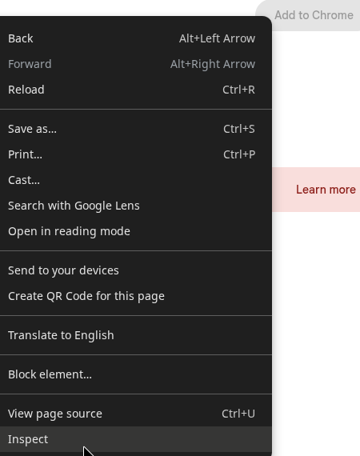

# Browser extensions I use

- **Single File**: Store copies of webpages including all assets as a single html file: [Firefox](https://addons.mozilla.org/en-US/firefox/addon/single-file/) | [Chrome](https://chromewebstore.google.com/detail/singlefile/mpiodijhokgodhhofbcjdecpffjipkle)
- **One Tab**: Collapse all of your open tabs into a webpage that you can share and keeps a running page for the life of your current install[One Tab](https://addons.mozilla.org/en-US/firefox/addon/onetab/)
- **Ublock Origin**: Control which scripts and other active elements are allowed to run on webpages based on a complex set of rules. From **yokoffing/betterfox**: you can apply these [reccommended filters](https://github.com/yokoffing/filterlists#guidelines). [Firefox](https://addons.mozilla.org/en-US/firefox/addon/ublock-origin/) | [Chrome](https://chromewebstore.google.com/detail/ublock-origin/cjpalhdlnbpafiamejdnhcphjbkeiagm)[^1]
- **Violent Monkey**: Fork of **Grease Monkey**,  allows you to alter the javascript on a page. There's a lot you can do with that. A community of these **user-scripts** exists where you can find modifications to popular websites. It's sort-of like a game genie for the web. [Firefox](https://addons.mozilla.org/en-US/firefox/addon/violentmonkey/)|[Chrome](https://chromewebstore.google.com/detail/violentmonkey/jinjaccalgkegednnccohejagnlnfdag)[^1]
- **Form History Control**: maintains a history of everything you enter into forms, may save you a lot of work if you have the bad habit of composing large amounts of text in webforms in spite of the many times you've lost your work when your browser froze up or battery died.  [Firefox](https://addons.mozilla.org/en-US/firefox/addon/form-history-control/) | [Chrome](https://chromewebstore.google.com/detail/form-history-control-ii/lpcccgcdjibejkgiaeijbmkpbnbkglkb)
- **Web Archives**: There's no single plugin that's particularly good. Here's a few decent ones, but you might search to find a better one. 
  - [Archiveror (Firefox)](https://addons.mozilla.org/en-US/firefox/addon/archiveror/): Archives the current page on archive.org wayback machine
  - [Wayback Machine (Chrome)](https://chromewebstore.google.com/detail/wayback-machine/fpnmgdkabkmnadcjpehmlllkndpkmiak):Official wayback machine plugin for chrome
  - [Archive Webpage (Chrome)](https://chromewebstore.google.com/detail/archive-page/gcaimhkfmliahedmeklebabdgagipbia): supports archiving to 7 different web archive sites
- **Old Reddit Redirect**: The old version of Reddit is better. [Firefox](https://addons.mozilla.org/en-US/firefox/addon/old-reddit-redirect) | [Chrome](https://chromewebstore.google.com/detail/old-reddit-redirect/dneaehbmnbhcippjikoajpoabadpodje) 
- **Auto Form**: Copy/Paste an entire form [Firefox](https://addons.mozilla.org/en-US/firefox/addon/auto-form/)|
- **Selenium IDE**: Automate complex interactions with websites. For testing and more [Firefox](https://addons.mozilla.org/en-US/firefox/addon/selenium-ide/) | [Chrome](https://chromewebstore.google.com/detail/selenium-ide/mooikfkahbdckldjjndioackbalphokd) | [Website](https://www.selenium.dev/selenium-ide/)[^1]

---

## Not extensions, but in the same category

- [**Betterfox**](https://github.com/yokoffing/Betterfox): A bunch of reccommended optimizations for Firefox.
- [**Puppeteer**](https://pptr.dev/):Puppeteer is a JavaScript library which provides a high-level API to control Chrome or Firefox over the DevTools Protocol or WebDriver BiDi. Puppeteer runs in the headless (no visible UI) by default
- [**Selenium**](https://www.selenium.dev/): There's more than just the IDE browser plugins.

---
[^1]:note: chrome store has disabled some useful extensions like ublock origin and violentmonkey... but, believe it or not, it's incredibly easy to bypass. Just follow these steps:

1. Right-Click->inspect on the **Add to Chrome** button to open the **Web Developer** panel
<figure>

<figcaption></figcaption>
</figure>
2. In the **Web Developer -> Elements** panel expand the container divs until you find the `<button>` element. 
<figure>

<figcaption>expand outermost div</figcaption>
</figure>
<figure>

<figcaption>at the time I created this document, there was one more, there could be more, keep going until you find the &lt;button&gt;</figcaption>
</figure>
3. Select the **disabled** attribute on the **&lt;button&gt;** element and delete it. Then hit *enter* to apply your changes.
<figure>

<figcaption>Select the attribute</figcaption>
</figure>
<figure>

<figcaption>Delete the attribute</figcaption>
</figure>
4. Note the **Add to Chrome** button is no longer greyed out and displays active. Click it to add the extension just as you normally would.
<figure>

<figcaption><strong>Add to Chrome</strong> button is active now.</figcaption>
</figure>
5. Click the **Add extension** in the dialog to confirm. 
<figure>

<figcaption>Confirm you want to add the extension.</figcaption>
</figure>
6. The extension should be enabled just like any other.
<figure>

<figcaption>The extension has been added successfully.</figcaption>
</figure>
